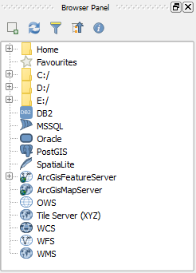

Another convenient way of loading ArcGIS REST service layers is using the
**Browser Panel**.

The **Browser panel** is usually visible by default. If it's not visible,
you can enable it going to **View > Panels > Browser Panel**.

Click **Next step** once you are done.