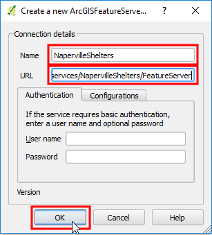

In the **Browser Panel** right-click the *ArcGISFeatureServer* and
choose **New Connection...**

In the **Create a new ArcGisFeatureServer connection** dialog, fill in the
following settings:

- **Name** = `NapervilleShelters`
- **URL** = `http://sampleserver6.arcgisonline.com/arcgis/rest/services/NapervilleShelters/FeatureServer`

Click **OK**

Click **Next step** once you are done.