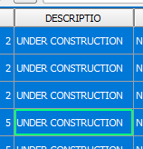

Back in the *Buildings* attribute table, let's confirm that all
the selected features were updated.

- In the **Attribute table** toolbar, click the **Move selection to
  top** button.

    

All selected feature attributes are moved to the top, and you can easily
confirm that, for all selected feature, the *DESCRIPTIO* field is now
`UNDER CONSTRUCTION`.

Click **Next step** once you are done.