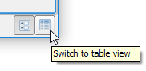

To confirm that the changes to the fields were in fact applied, let's turn off
the multi edit mode, and go back to table view.

- In the attribute table toolbar, click the **Toggle multi edit** button.

    

- In the attribute table bottom-right corner, click the **Switch to
  table view** button.

    

Now you can confirm that both the *DESCRIPTIO* and the *UPDATE_DAT* fields
have been updated for all the selected features.

Click **Next step** once you are done.