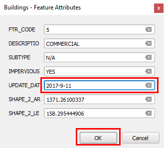

- With *Building* as the active layer, and the identify tool active, click
on the building that we have edited earlier.

    

The *Feature Attributes* dialog opens showing the feature attribute's values.

- Change the *UPDATE_DAT* attribute to a more recent date. Click
**OK** to apply the changes and close the feature form.

    

Click **Next step** once you are done.