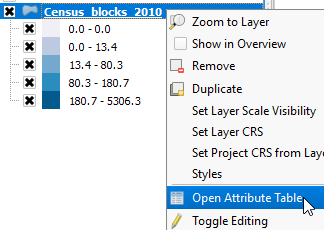
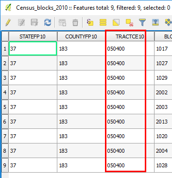

Now that we have a Filter enabled, let's confirm that it works.

- Check the map canvas. Only the most north part of Raleigh Downtown shows
some *Census_blocks_2010* features.

    

- In the **Layers Panel**, right-click the *Census_blocks_2010* layer
and select **Open Attribute Table**

    

- In the *Census_blocks_2010* attribute table, confirm that only
features with the value 050400 for the *TRACTCE10* attribute are
showing.

    

- Close the *Census_blocks_2010* attribute table.

Click **Next step** once you are done.