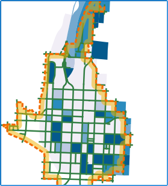

Now that we have modified the filter, let's confirm that it works.

- Check the map canvas. Almost all Raleigh Downtown is showing
*Census_blocks_2010* features.

    

- In the **Layers Panel**, right-click the *Census_blocks_2010* layer
and select **Open Attribute Table**

    

- In the *Census_blocks_2010* attribute table, confirm that
features with the value 050100 for the *TRACTCE10* attribute are
also showing.

    

- Close the *Census_blocks_2010* attribute table.

Click **Next step** once you are done.