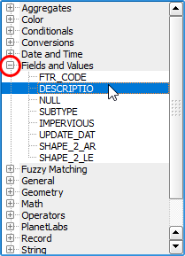

The **Select by expression - Buildings** dialog opens.

On the left side of the dialog, you will find an empty text box where
you can type the expressions. On the middle, you will find a list of all
available functions, fields, and variables by categories. Finally, on the
right side of the dialog, there is a help box that will provide useful
information about each function.

We will start by selecting all the commercial buildings.

- From the list of functions' categories, expand the **Fields and
values** one. Then, double-click the `DESCRIPTIO` field to add it to the
expression.

   

- Click the `=` button (equal operator) or type it directly in the
expression.

   

- On the right side, next to **Load values**, click **all unique**.
Then, double-click `COMMERCIAL` to add it to the expression.

   

The expression should look like this:

 `"DESCRIPTIO"  =  'COMMERCIAL'`

On the bottom-right corner, click **Select** to apply the expression and
then **Close**.

Click **Next step** once you are done.