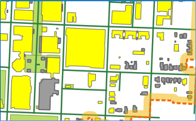
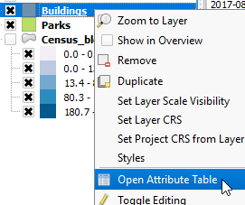

In the map canvas, several buildings will be highlighted in yellow,
showing that they are selected features.

- In the **Layers Panel**, right-click the *Buildings* layer and choose
open attribute table.

   

- In the attribute table, confirm that only Commercial buildings are
selected.

   

- Close the attribute table, and get back to QGIS main window.

Click **Next step** once you are done.
