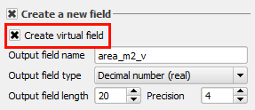

In the **Field calculator** dialog:

- Keep the **Create new field** option enabled. Set the rest of the
  options as shown below.

    

  Most of the settings are the same as you used before, but this time
  the **Create virtual field** option is enabled.

- In the **Expression** text box, type in the following expression and click
  **OK**.

    `$area`

    

Looking at the attributes table, you can confirm that a new field called
*area_m2_v* exists and it's populated with values. Besides, the values
are the same as the *area_m2* field.

To confirm that the virtual field works as expected, in the next step,
we will change a feature's geometry and see what happens.

Click **Next step** once you are done.