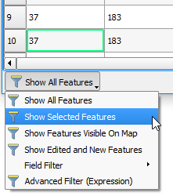

One way of making the selected features stand is to push them to the
top of the attribute table.

- Keeping the previous selection, in the attribute table, click the
**Move selection to top** button to activate this option.

  

All the selected features move to the top rows of the attribute table.

Another way of emphasizing the selected rows is to hide all the other
rows.

- In the bottom left corner of the Attribute Table Windows, click the
**Show All features** button and choose **Show Selected Features** from
the drop-down list.

  

The table of attributes will filter out all the features that were not
selected.

**Note:** Both the **Move selection to top** and selected features
filtering are dynamic, which means that the table will change if the
selection change.

Click **Next step** once you are done.