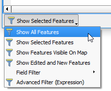
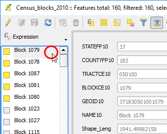

Until now, we have always seen the attribute table in a table-like
structure, however it's possible to change it to a form view mode.

- Let's start by removing the features filtering. In the bottom left
corner of the Attribute Table window, click the **Show All Features**
button and choose **Show Selected Features** from the drop-down list.

  

- Now, in the bottom right corner of the Attribute Table window, click
the **Switch to form view** button.

  

The attribute table will be vertically split. In the left-hand side,
there's a list of all features populated with the values of a single
column. In this layer case, the values of the *NAME* column. You can
choose to use other columns or even an expression to populate that list.

Note that beside each name in the list, there are small squares. Yellow
squares show the features that are selected. Moreover, clicking the
squares will also select/deselect the features, and you can hold `Ctrl`
to select several rows.

In the right-hand side of the window, you will see a Feature Form. The
Feature Form is a more organized and customizable way of showing
features' attributes (See lesson about customizing feature forms). On
the other hand, it's only possible to show a single feature's attributes
at a time.

- In the left-hand side list, click the name of the first element (not
the square!) to show its feature form.

  

Click **Next step** once you are done.