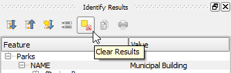

To clear the the Identify Result panel, you can either use the Identify
Feature tool in an empty region of the Map Canvas or click the **Clear
results** button in the **Identify Results** panel toolbar.

This step ends the lesson, click **Finish Lesson**.