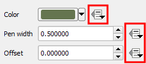

If you have been styling vector layers for a while, you may have noticed that, in the Layer Properties dialog, almost every style's and label's options have a small data-override button next to it.

The presence of that data-override button next to an option means that you can use the layer attribute's values to set it. As you can imagine, the possible uses for this feature are endless. This lesson presents a couple of simple examples on how to use data-defined properties to control a vector layer's style.

When you are ready to start, click **Next step**.