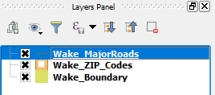

The most simple use for data-defined properties is when an attribute's type and its values fit the option's range of accepted values. In that case, you can set the layer's field directly in the data-override settings. Let's do it to the line width settings in the *Wake_MajorRoads* layer.

If you open the layer's attribute table, you will notice a *roadwidth* field. This field contains made-up values of road width, added for this lesson's purpose only.

In the **Layers Panel**, click the *Wake_MajorRoads* layer to make it active.

The layer should be highlighted now.

Click **Next step**.