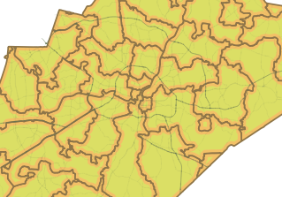
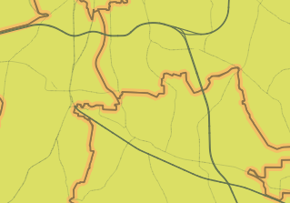

Now, although we are still using a single symbol renderer, the *Wake_MajorRoads* layer shows lines with different widths.

Besides, because we choose to use "map units", the lines are scaled to ground "real-size" values. So, if you zoom in, the line's width will increase.

The lines are still very hard to see at smaller scales. Let's tweak that a bit. For data-override settings, you can also use expressions. In the next steps, we will create and use an expression that multiplies the *RoadWidth* field by 10.

Click **Next step**.