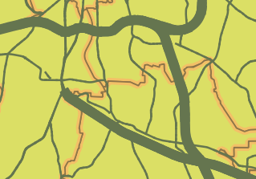

Now, in the map canvas, you should see much thicker lines.

In the next example, we use a bit more elaborate expression for trying to show how powerful data-define properties can be. We will make the layer style depend on another layer's attributes and geometries.

Click **Next Step**.