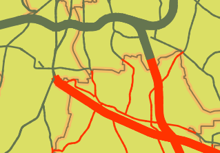

What the expression we have used before does is check if each feature in *Wake_MajorRoads* layer (i.e., each road) intersects the *GARNER 27529* Zip Code in the *Wake_ZIP_Codes* layer. If it does, the line is drawn in red, if not, the line is drawn in dark green instead.

This step ends the lesson, click **Finish**.