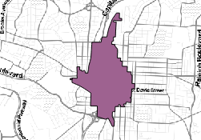
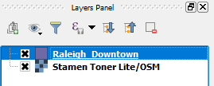

In QGIS, vector layers are styled by default using a single symbol. That means that, unlike with categorized or graduated symbols, all features of the layer will draw in the map canvas using the same symbol. This lesson shows how to change a symbol. Besides, it also shows how to create composed symbols.

The lesson's project have a layer called *Raleigh_Downtown*, which is styled using an opaque fill. But it would be nice if we could see the basemap as well.

In the **Layers Panel**, click the *Raleigh_Downtown* layer's name to make it active.

The layer's item should be highlighted.

Once you have finished, click **Next step**.