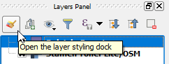
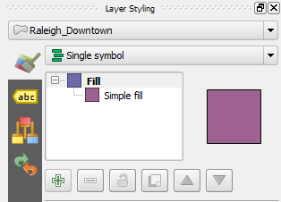

With the *Raleigh_Downtown* layer active, in the **Layers Panel**,
click the **Open the Layer styling dock** button.

The **Layer Styling** panel should open on the right-side of QGIS window
with the *Raleigh_Downtown* layer selected.

Once you have finished, click **Next step**.