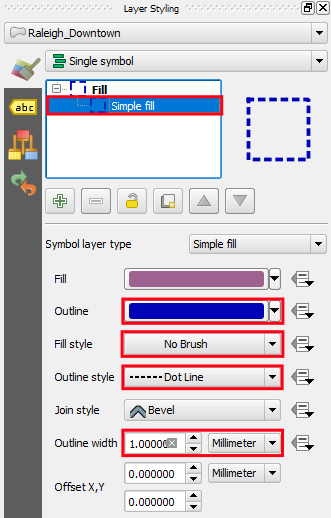
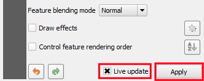

In the **Layer Styling** panel:

  1. Under **Fill**, click **Simple Fill**;
  2. Set **Fill style** to `No brush`;
  3. Set **Outline** color to `Blue` (example: `#1f78b4`);
  4. Set **Outline style** to `Dot Line`;
  5. Set **Outline width** to `1.0` `Milimeter`;

    

If, at the bottom of the panel, the **Live update** option is enabled,
the style changes will be visible on the map canvas automatically.
Otherwise, click **Apply**.

Click **Next step** once you are done.