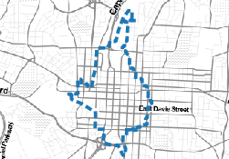
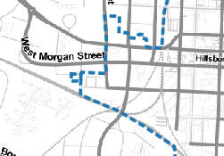

On the map canvas, you should confirm that all the features of the
*Raleigh_Downtown* layer are represented with a simple fill style,
with hollow polygons with a dashed blue outline.

But, if we zoom a bit more, sometimes it's hard to tell what's inside
the polygons, and what's outside.

There are other style types for polygon layers, and we can combine them
with the previous one. That's what we will do in the next steps.

Once you are ready, click **Next step**.