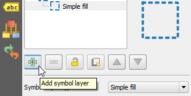
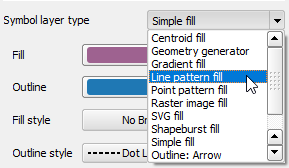
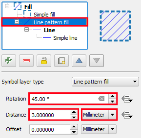
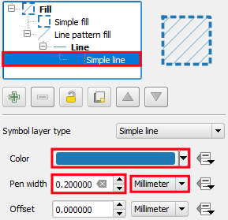

- Back in the **Layer Styling** panel, click the **Add symbol layer**
  button.

    

- On the same toolbar, click the **Move down** button to make the new
  symbol layer go bellow the previous one.

- Now, with the new **Simple fill** symbol layer selected, click the
  **Symbol layer** type. Take some time to examine all the available
  options for polygons. Then, choose the `line pattern fill`.

    

With the **Line pattern fill** selected:

- set the **Rotation** to `45.0º`;
- set **Distance** to `3` `Milimeter`.

    

Under the **Line pattern fill**, click **simple line**. Then:

- set the **Color** to `Blue` (example: `#1f78b4`);
- set **Pen Width** to `0.2` `milimeter`.

    

If, at the bottom of the panel, the **Live update** option is enabled,
the style changes will be visible on the map canvas automatically.
Otherwise, click **Apply**.

Click **Next step** once you are done.