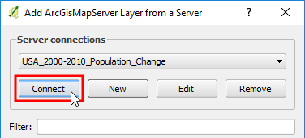

In the **Add ArcGisMapServer Layer from a server** dialog,
under **Server connections**, click **New**.

In the **Create a new ArcGisMapServer connection** dialog, fill the
following settings:

- **Name** = `USA_2000-2010_Population_Change`
- **URL** = `http://services.arcgisonline.com/arcgis/rest/services/Demographics/USA_2000-2010_Population_Change/MapServer`

Click **OK**

Back in the **Add ArcGisMapServer Layer from a server** dialog,
under **Server connections**, keeping the *USA_2000-2010_Population_Change*
connection selected click **Connect**.

From the list of available layers, click the *States* layer, and then click
**Add**.

Click **Next step** once you are done.