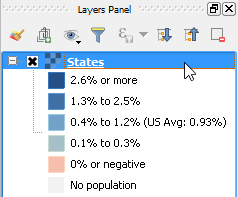
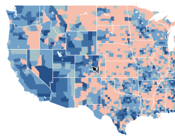
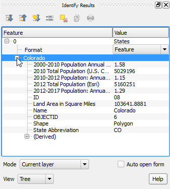

The *states* layer should have loaded in the map canvas. You can zoom in
to see it at different detail levels.

Note that, MapServer layers, even being raster layers, may allow
inspecting the layer's attributes.

In the **Layers Panel**, click *States* to make it active.

From menus, go to **View > Identify Features** to enable the *Identify tool*.
Alternatively, you can click the **Identify Features** from the
*Attributes toolbar*.

With the identify tool enabled, click anywhere on the US territory.

The **Identify Results** panel opens. Click the small icon next
to the State's name to open the attributes list of the feature.

Click **Next step** once you are done.