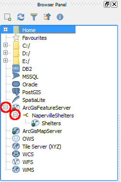
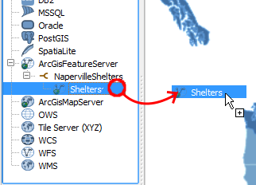

Now that we added a new ArcGISFeatureServer connection, we can list and
load layers from the browser panel.

In the **Browser Panel**, click the small icon next to *ArcGISFeatureServer*
to show its connections.

Then, click the small icon next to *NapervilleShelters* to fetch its
layers list.

Right-click the *Shelters* layer and select **Add layer**.

Alternatively, you can simply drag and drop the *Shelters* layer into
the map canvas to load it.

Click **Next step** once you are done.