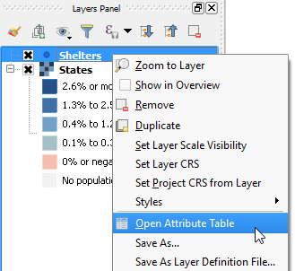
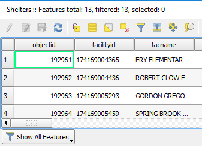

The *Shelters* layer should have loaded in the layers panel and map canvas.

Note that ArcGISFeatureServer layers fetch real vector features. Therefore,
you can use them as any other vector layer. To test that, let's open the
layer's attribute table.

In the **Layers Panel**, Right-click the *Shelters* layer and select
**Open Attribute table**.

The Layer's attribute table will open, where you can check its attributes,
query features, and so on.

This step ends the lesson, click **Finish Lesson**.