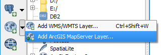
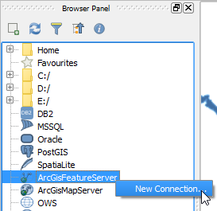

# Load ArcGIS REST services layers

## 01_introduction

From version 2.18 onwards, QGIS can open ArcGIS REST services layer
natively. Both MapServer and FeatureServer layers are supported.

In this lesson, we will show you how setup connections to ArcGIS REST
services and load layers on the map canvas.

## 02_open_arcgis_add_mapserver_layer.md

One way of adding ArcGIS REST services layers to the map canvas is using
the dedicated tools in the toolbar and menu.

From the menus, click **Layers > Add Layer > Add ArcGIS MapServer**.

Alternatively, click the **Add ArcGIS MapServer layer** in the *Manage Layers Toolbar*

Once clicked, the lesson will automatically move to the next step.

## 03_setup_connection.md

In the **Add ArcGisMapServer Layer from a server** dialog,
under **Server connections**, click **New**.

In the **Create a new ArcGisMapServer connection** dialog, fill the
following settings:

- **Name** = `USA_2000-2010_Population_Change`
- **URL** = `http://services.arcgisonline.com/arcgis/rest/services/Demographics/USA_2000-2010_Population_Change/MapServer`

Click **OK**

Back in the **Add ArcGisMapServer Layer from a server** dialog,
under **Server connections**, having the *USA_2000-2010_Population_Change*
connection selected click **Connect**.

From the list of available layers, click the *States* layer, and then click
**Add**.

Click **Next step** once you are done.

## 04_inspect_ArcGisMapServer_layer.md

The *states* layer should have loaded in the map canvas. You can zoom in
to see it at different detail levels.

Note that, MapServer layers, even being raster layers, may allow
inspecting the layer's attributes.

In the **Layers Panel**, click *States* to make it active.

From menus, go to **View > Identify Features** enable the *Identify tool*.

Alternatively, you can or click the **Identify Features** from the
*Attributes toolbar*

With the identify tool enabled, click anywhere in the US territory.

The **Identify Results** panel should open. Click the small arrow next
to the State's name to check the attributes of the feature.

Click **Next step** once you are done.

## 05_open_browser_panel.md

Another convenient way of loading ArcGIS REST service layers is using the
**Browser Panel**.

The **Browser panel** is usually visible by default. If it's not visible,
you can enable it going to **View > Panels > Browser Panel**.

Click **Next step** once you are done.

## 06_Add_a_connection_in_browser.md

In the **Browser Panel** right-click the *ArcGISFeatureServer* and
choose **New Connection...**

In the **Create a new ArcGisFeatureServer connection** dialog, fill in the
following settings:

- **Name** = `NapervilleShelters`
- **URL** = `http://sampleserver6.arcgisonline.com/arcgis/rest/services/NapervilleShelters/FeatureServer`

Click **OK**

Click **Next step** once you are done.

## 07_load_layer_in_canvas_from_browser.md

Now that we added a new ArcGISFeatureServer connection, we can list and
load layers from the browser panel.

In the **Browser Panel**, click the small icon next to *ArcGISFeatureServer*
to show its connections.

Then, click the small icon next to *NapervilleShelters* to fetch the
layers list.

Right-click the *Shelters* layer and select **Add layer**

Alternatively, you can simply drag and drop the *Shelters* layer into
the map canvas to load it.

Click **Next step** once you are done.

## 08_inspect_arcgisFeatureServer_layer.md

The *Shelters* layer should have loaded in the layers panel and map canvas.

Note that ArcGISFeatureServer layers fetch real vector features. Therefore,
you can use them as any other vector layer. To test that, let's open the
layer's attribute table.

In the **Layers Panel**, Right-click the *Shelters* layer and select
**Open Attribute table**.

The Layer's attribute table will open, where you can check its attributes,
query features, and so on.

This step ends the lesson, click **Finish Lesson**.