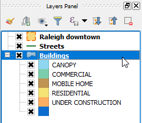
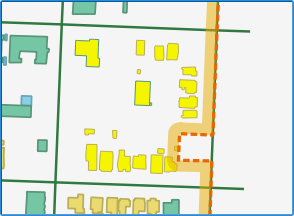

For this lesson, as an example, we will use the *Buildings* layer. We
will simulate that a full block is going to become Commercial, and we
will update the data.

Let's start by selecting all the buildings on the block in the
center of the map canvas.

- In the **Layers Panel**, click the *Buildings* layer to make it active.

    

- In the **Attributes toolbar**, click the **Select by area or single
  click** to enable it.

    

- In the map canvas, draw a rectangle around all the buildings in the
  block by clicking and dragging, making sure not to cross buildings
  outside.

    

All selected buildings will be rendered in bright yellow.

Click **Next step** once you are done.