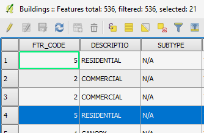

Now that we have some buildings selected, let's open the *Buildings*
layer's attribute table.

- In the Layers Panel, right-click the *Buildings* layer and
choose **Open Attribute Table**.

    

- Alternatively, having the *Buildings* layer active,
you can click the **Open Attribute Table** button in the **Attributes
toolbar**.

    

An **Attribute Table** window for the *Buildings* layer will open
listing all of the layer's 536 features attributes in a table with 21
features selected.

Click **Next step** once you are done.