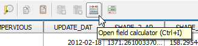
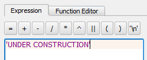

One way to change the attributes of multiple features at the same time is
to use the field calculator. As an example, for now, we want to change
all the selected building to `UNDER CONSTRUCTION`.

- In the **Attribute table** toolbar, click the **Open field
  calculator** or press `CTRL + I`.

    

In the **Field Calculator** dialog:

- Enable the *Only update n selected features* option.

    

- Enable **Update existing field** option and choose the *DESCRIPTIO*
  field.

    

- In the Expression text box, instead of an expression, type in the
  value directly, that is `'UNDER CONSTRUCTION'`.

  

  Note the single quotes (') around the value to indicate that the value is a
  text string and not some field or variable.

- Click **OK** to update the features and close the **Field calculator**.

Click **Next step** once you are done.