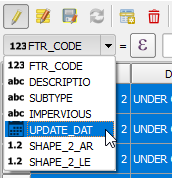
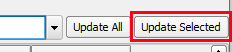
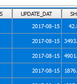

Instead of opening the Field calculator dialog every time you want to
update a field for multiple features, you can use the *Quick field
calculator bar*.

When a vector layer is in editing mode, the *Quick field calculator bar*
appears below the attribute table toolbar.

As an example, keeping the same features selected, we will update
the *UPDATE_DAT* field to reflect the new changes.

- Select the *UPDATE_DAT* field from the field combo box.

    

- In the long text box, type in a more recent date, for example,
  `'2017-08-15'`. Please mind the single quotes (') around the date.

    

- Click the *Update Selected features* button.

    

You can immediately confirm that the *UPDATE_DAT* field was updated
with the new value.

Click **Next step** once you are done.