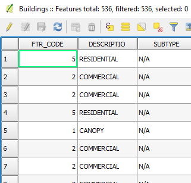

The current project has a layer called *Buildings*. During the lesson,
we will edit some of its attributes. We will start by editing using the
attribute table, so, let's start by opening the layer's attribute table.

- In the Layers Panel, right-click the *Buildings* layer and
choose **Open Attribute Table**.

    

- Alternatively, having the *Buildings* layer active,
you can click the **Open Attribute Table** button in the **Attributes
toolbar**.

    

An **Attribute Table** window for the *Buildings* will open
listing all of the layer's 536 features attributes in a table.

Click **Next step** once you are done.