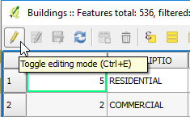

Before you can edit a layer, it must be in Edit mode. There are several
ways of changing a layer to edit mode, but, for our example, using the
button available in the Attribute table is more straightforward.

- In the Attribute table toolbar, click the **Toggle edit mode**.

    

Alternatively, you can use a similar button located in the *Digitizing
toolbar*, in QGIS's main window, or right-click the *Buildings* layer in
the *Layers Panel* and choose *Toggle Editing*.

Click **Next step** once you are done.