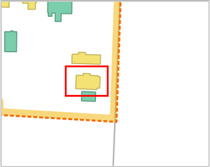
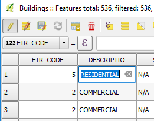

In the map canvas, notice the residential building in the corner. It
matches the first row in the attribute table, which we will edit.

- Back in the attribute table, in the first row, click the cell in the
*DESCRIPTIO* column to start editing it.

    

- Type in `COMMERCIAL` and press **Enter**.

If you go back to the map canvas, you can confirm that the building
representation has changed.

Click **Next step** once you are done.