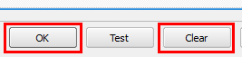

- At the bottom of the **Query Builder** dialog, click **Clear**, to
remove the current WHERE clause and apply the change. Then, click
**OK** to close the dialog.

    

Click **Next step** once you are done.