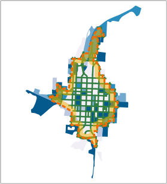

Let's confirm that the filter was in fact cleaned. In the map canvas,
you will notice that all the blocks seem to be showing.

- In the **Layers Panel**, right-click the *Census_blocks_2010* layer
and select **Open Attribute Table**

    

- In the *Census_blocks_2010* attribute table, confirm that features
with the different values for the *TRACTCE10* attribute are now showing.

    

This step ends the lesson, click **Finish**.