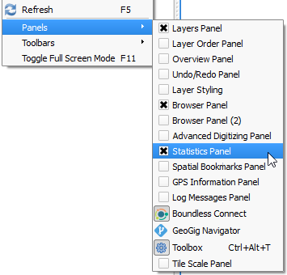
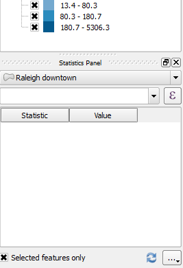

By default, QGIS does not enable the **Statistics Panel**, so you may
have to enable it yourself.

- In menus, click on **View > Panels > Statistics Panel** to enable it.

  

By default, the **Statistics Panel** opens on the left side panels area,
below the **Layers Panel**.

Click **Next step** once you are done.