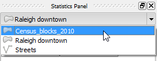
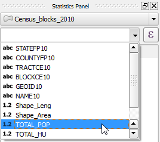
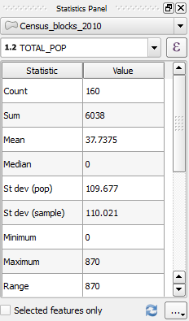

Now, that the **Statistics Panel** is enabled, let's use it to get
statistics from the *Census_blocks_2010* layer.

- In the **Statistics Panel**, click the top most drop-down button and
select the *Census_blocks_2010* layer from the list.

  

- Then, click the drop-down button below and select the *TOTAL_POP*
field.

  

The **Statistics Panel** will then be populated with several statistics
of the field like SUM, Mean, Standard deviation, and so on.

Click **Next step** once you are done.