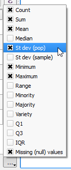
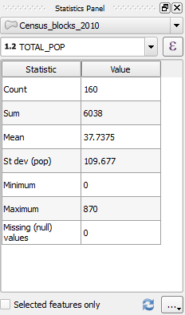

Not all statistics may have interest, for that reason, there is a way to
select which statistics you want to be shown.

- On the bottom right corner, click the **...** button. Click the
drop-down list elements to enable and disable statistics.

  

The statistics results are shortened showing only the selected statistics.

Click **Next step** once you are done.