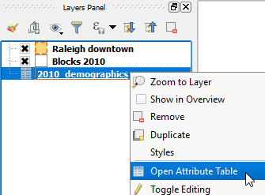

Now, let's inspect the *2010_demographics* layer's attribute table.

* In the **Layers Panel**, right-click the *2010_demographics* layer and
  select **Open Attribute Table**.

    

* In the Attribute table dialog, confirm that there are some population
  or housing units fields present.

    

    Note that there is also a *BLOCKID* field that contains values similar to
    the GEOGID10 field in the *Block 2010* layer. Therefore, we can  use
    those two fields values to join the tables.

* Close the *Blocks 2010* Attribute table

Click **Next step** once you are done.