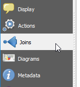
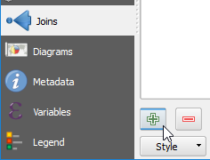
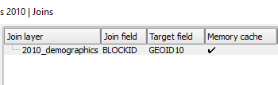

* In the **Layers Properties - Blocks 2010**, click the **Join** tab.

    

* There are no joins yet for this layer. Click the **Add Join** button
  to create one.

    

The **Add vector join** dialog will open. Set the following options:

1. Set **Join table** to `2010_demographics`
2. Set **Join field** to `BLOCKID`
3. Set **Target field** to `GEOID10`

These are the minimum necessary settings, but you can also set the
rest of the options.

1. Enable **Choose which fields are joined** and select:

    * `TOTAL_POP`
    * `TOTAL_HU`
    * `OCCUPIED`
    * `VACANT`

2. Enable **Custom field name prefix** and type `2010_`.

* Click **OK** to accept the options and close the **Add Vector join** dialog

    

In the **Layers Properties - Blocks 2010** you will see the newly
created join.

* Click **OK** to apply the changes and close the **Layers Properties** dialog.

Click **Next step** once you are done.