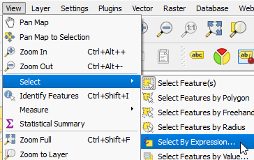

- Keeping the *Buildings* layer active, from menus, go to **View > Select > Select by Expression**

   

- Alternatively, in the **Attributes** toolbar click the **Select
features using an expression** button.

   

Once you click, the lesson will move to the next step.