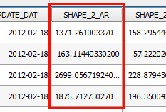

The current project has a layer called *Buildings*. During the lesson,
we will update some of its fields and create new ones. Let's start by
opening the layer's attribute table where it will be easier to see the
updates we make.

- In the Layers Panel, right-click the *Buildings* layer and
  choose **Open Attribute Table**.

    

An **Attribute Table** window for the *Buildings* layer will open
listing all of the layer's 536 features attributes in a table.

As you can see, the *SHAPE_2_AR* field stores information about the
features' area in square feet.

Let's say we want to convert all those values into square meters. Using
a conversion factor of 1 foot = 0.3048 meters we can use the field
calculator to recalculate all the values. That's what we will do in the
next steps.

Click **Next step** once you are done.