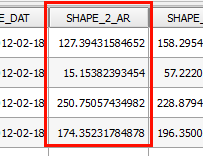
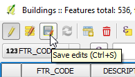

In the **Field calculator** dialog:

- Enable **Update existing field** option and select the *SHAPE_2_AR*
  field.

    

- In the Expression text box, type in the following expression and click
  **OK**.

    `"SHAPE_2_AR" * 0.3048 ^ 2`

    

**About the expression:** The *SHAPE_2_AR* field name inside double quotes
(") returns the attribute's value, which is then multiplied by the square
of the conversion factor.

---

**NOTE:** Field names inside double quotes (") returns the fields'
values, if instead, we put it inside single quotes ('), it would
literally returns the string.

`"SHAPE_2_AR"` → 1371.26...

`'SHAPE_2_AR'` → SHAPE_2_AR

---

Looking at the *SHAPE_2_AR* column values in the attribute table, you
can confirm that all values have been updated.

Notice that, the *Buildings* layer is now in editing mode and changes
are ready to be saved as the **Save Edits** button is enabled.

This gives you the opportunity to either permanently save the changes to
the data source, by clicking the **Save Edits** button, or discard the
changes by turning editing mode off without saving.

Click **Next step** once you are done.