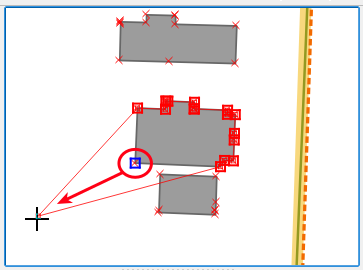
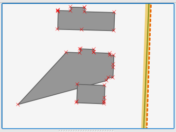
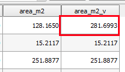

To confirm that the virtual field works as expected, in this step,
we will change a feature's geometry and see what happens.

The building in the center of the map canvas matches the first row in
the attribute table, making it an excellent feature for testing.

- If the *Buildings* layer is not in edit mode already, make it editable
  by clicking the **Toggle Editing mode** button in the **Digitizing
  toolbar**.

    

- In the **Digitizing toolbar**, click the **Node Tool** to enable it.

    

- Now click and drag one of the building's nodes to make the geometry
bigger than it is now.

    

    

- Back in the Buildings Attribute table, click the **Save edits** button.

    

Once you save the changes to the data source, the *area_m2_v* virtual
field of the first row is updated.

This step ends the lesson, click **Finish**.