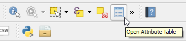

The current project has a layer called *Census_blocks_2010*. Let's open
its attribute table.

- In the Layers Panel, right-click the *Census_blocks_2010* layer and
choose **Open Attribute Table**.

  

- Alternatively, having the *Census_blocks_2010* layer active,
you can click the **Open Attribute Table** button in the **Attributes
toolbar**.

  

An **Attribute Table** window for the *Census_blocks_2010* will open
listing all of the layer's 160 features attributes in a table.

You can scroll vertically and horizontally to see all rows and columns.

**Note 1:** QGIS will create an independent window every time
you ask to open a layer's attribute table. Which means that, you may end
up with several Attribute Table windows opened for the same layer. For
new comers, this can be confusing, but it is not a bug, it's a way for
you to compare two tables, if necessary.

**Note 2:** In QGIS option (**Settings > Option**), in the
**Data Sources** tab you can enable the **Open attribute table in a dock
window** option to integrate the attribute tables in QGIS main window.

Click **Next step** once you are done.