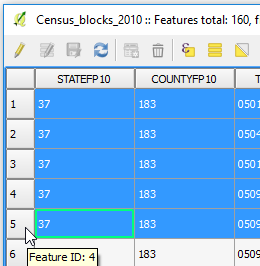
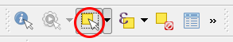

Unlike the identify features, which only shows attributes of the
features we request, the attribute table lists all the layer's
attributes. Although handy for many purposes, this can make relating the
attributes to the features (geometries) in the map canvas very hard.
However, there are a couple of ways of exposing that relation. One the ways is
selecting features.

- In the **Attribute Table**, you can select features by clicking the row
number on the far left-hand side. As an example, select the first row by
clicking the number 1.

  

The selected row becomes blue. Moreover, in QGIS main window, more
precisely in the map canvas, the selected feature turns yellow.

In complex projects, or with small features, it can still be difficult
to find the selected feature. Either from QGIS main window or the
Attributes Table, you can zoom to the feature.

- In the attribute table toolbar, keeping the row selected, click the
**Zoom map to selected rows** button.

   

As advertised, the map canvas will zoom to the selected feature, which
now fills the all screen, making it impossible to miss.

- You can select several rows in the attribute table. Hold the `Ctrl`
key and click in more rows.

  

- Click the **Zoom map to selected rows** button again to see where the
features are located.

You can also select features in the map canvas and have them highlighted
in blue in the attribute table.

- In QGIS main window, click the **Select features by area or single
click** button in the Attributes toolbar to enable it.

  

- Now, holding the `Ctrl` key, click on some features. Alternatively,
you can click and drag to select an area.

  

Going back to the attribute table, you can tell by the window's title
that several features are selected, but once again it's not easy to find
the selected rows if the layer has too many features. We will work on
that in the next steps.

Click **Next step** once you are done.