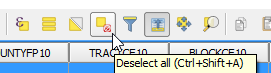
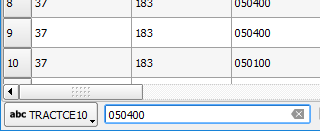

If you are looking for features with a certain attribute's value, you
can use a filter, similar to the one we used to show only the selected
features.

Let's start by going back to table view and clean the selection.

- In the bottom right corner, click the **Switch to table view** button.

  

- In the Attribute Table toolbar, click the **Deselect all** button.

  

Let's imagine that we wish to see the attributes of all the Census Blocks
belonging to the Tract with the number 050400.

- In the bottom left corner of the Attribute Table window, click the
**Show All Features** button and choose **Field filter**, and then the
*TRACTCE10* field from the drop-down list.

  

- An empty text box will show at the bottom of the Attribute Table prefixed
with the name of the field we have chosen. Type in `050400` and press
`Enter`.

  

Now, only the 9 rows corresponding to the Tract will show in the
attribute table.

This step ends the lesson, click **Finish Lesson**.