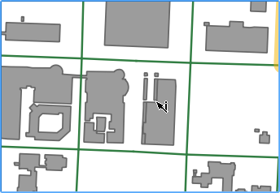
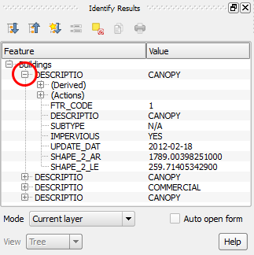
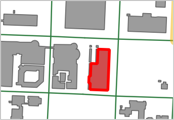

If you click near more than one feature, several features are
identified and have their attributes shown.

- Keeping the *Buildings* layer active, click in a place where there are
two or more buildings nearby.

  

The **Identify Results** shows several features attributes. If
necessary, click the small icon next to the *DESCRIPTIO* row to show the
feature's attributes.

Note that, in the map canvas, more than one feature is highlighted
in red.

- In the **Identify Results**, click on one of the DESCRIPTIO rows in
the results tree. This way, you can tell which attributes belong to each
feature, because only one feature will become highlighted.

  

  

Click **Next step** once you are done.